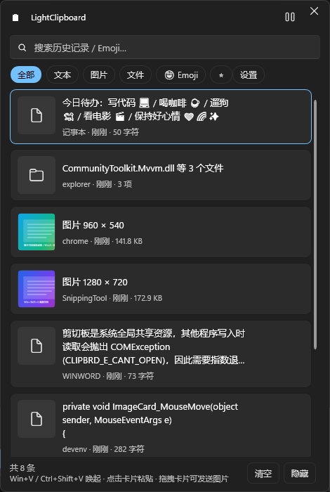
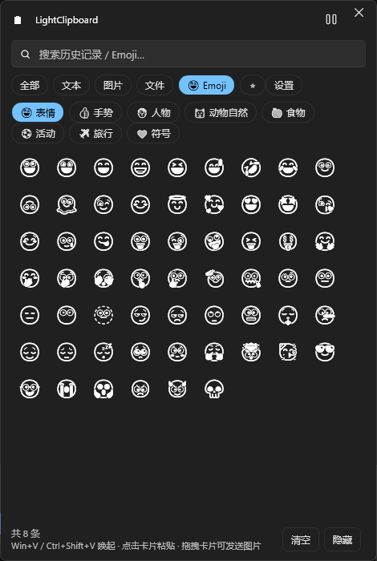
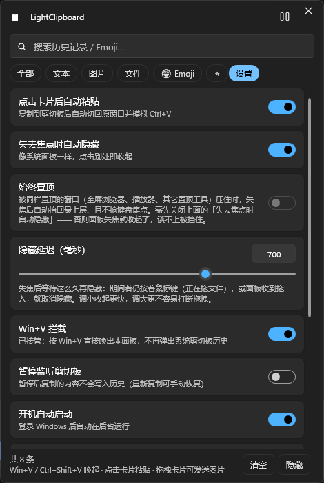
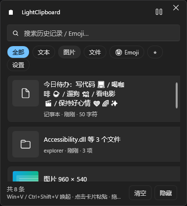
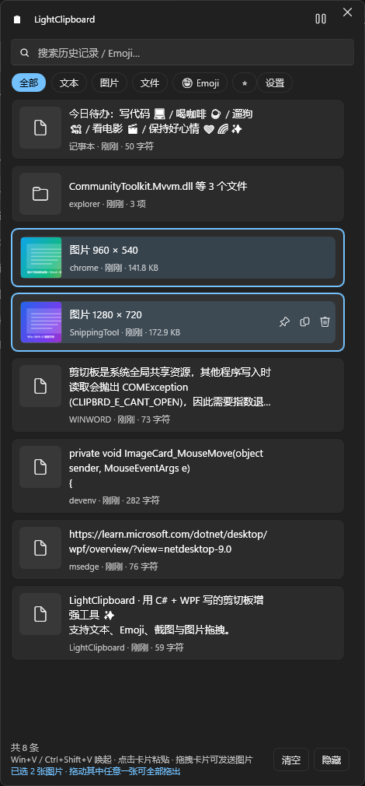

# LightClipboard

C# + WPF 实现的 Windows 剪切板增强工具。常驻托盘、按需弹出面板，自动记录**文本 / Emoji / 图片（含 Win+Shift+S 截图）/ 文件**历史，支持把图片**拖拽**到桌面、资源管理器、Word、微信等外部程序（v1.3.0 起可 Ctrl/Shift **多选图片、整批拖出**），也支持把文件直接拖进面板归档；并可**接管系统 Win+V**，用本程序面板替代 Windows 原生剪切板历史。

按照原始架构方案（见 [`resources/00-原始设计文档.txt`](resources/00-原始设计文档.txt)）实现：MVVM + WPF-UI（Fluent）+ LiteDB + 图片落盘缓存 + OLE 拖拽。

---

## 0. 开发者请看这里

完整开发资料在 **[`resources/`](resources/README.md)**：

| 想做什么 | 看哪篇 |
| --- | --- |
| 快速了解架构 | [01-架构设计](resources/01-架构设计.md) |
| 动手改代码（含"常见需求 → 改动落点"表） | [02-源码导读](resources/02-源码导读.md) |
| 改剪切板 / 图片 / 拖拽 / UI 前**必读** | [04-实现细节与坑点](resources/04-实现细节与坑点.md) |
| 改 Win+V 接管 | [需求与方案原文](resources/09-Win+V拦截需求与方案.txt) + [04 坑点 17](resources/04-实现细节与坑点.md#17-winv-接管钩子回调的三条红线--抢焦点的两个坑) + [06 §4.1](resources/06-Win32与系统集成.md#41-winv-接管低级键盘钩子) |
| 发布与测试（含 Win+V 验证脚本） | [07-构建发布与测试](resources/07-构建发布与测试.md) |

---

## 1. 快速开始

```powershell
# 开发运行（自动弹出面板）
cd src\LightClipboard
dotnet run

# 后台运行（不弹面板，只驻留托盘）
dotnet run -- --hidden

# 写入演示数据（界面自检用）。注意 --demo 自己不做隔离：
# 必须先设好 LIGHTCLIPBOARD_HOME，否则演示数据会写进真实历史
$env:LIGHTCLIPBOARD_HOME = "$env:TEMP\LightClipboard-Demo"
dotnet run -- --demo

# 无界面自检（110 项 / 13 组：目录布局 / 设置持久化 / 存储 / 输出排序 / 输出后剪切板还原 / 图片缓存 / 剪切板读写 / 拖拽数据 / 多选拖拽 / 多选状态机 / 监听 / 热键 / Win+V 钩子）
dotnet run -- --selftest ; Get-Content "$env:TEMP\LightClipboard-SelfTest\Logs\selftest.txt"
```

发布单文件 exe（自带 .NET 运行时，目标机器无需安装任何依赖）：

```powershell
cd src\LightClipboard
dotnet publish -c Release
# 产物：bin\Release\net10.0-windows\win-x64\publish\LightClipboard.exe
```

改完代码要运行 Release 版时记得重建，否则跑的仍是旧产物：

```powershell
dotnet build -c Release
# 产物：bin\Release\net10.0-windows\win-x64\LightClipboard.exe
```

> 混用 Debug / Release 很容易造成「代码改了却没生效」的假象 —— 判断当前跑的是哪一版：
> 设置页「关于」里的版本号，或日志里有没有对应功能的启动记录（例：`[KeyboardHookService] 已挂载低级键盘钩子`）。

### 发布方式与内存占用

实测空载工作集（同一台机器；单文件一行为 **v1.1.0** 重新实测，载入的是 `--demo` 演示数据
—— 8 条 = 文本 5 + 图片 2 + 文件 1，与 [07 篇](resources/07-构建发布与测试.md) 的构成一致；
自包含多文件与框架依赖两行为 v1.0.1 的历史实测值，最下面那行「框架依赖单文件」**未实测**
—— 本功能改动不影响内存量级）：

| 方式 | 命令 | 体积 | 空载工作集 |
| --- | --- | --- | --- |
| **单文件自包含**（默认，分发首选） | `dotnet publish -c Release` | 单个 exe 61.73 MB | ≈ 260 MB |
| 自包含多文件 | 追加 `-p:PublishSingleFile=false` | 目录约 150 MB | ≈ 150 MB |
| 框架依赖（需装 .NET 10 桌面运行时） | 追加 `-p:SelfContained=false -p:PublishSingleFile=false` | 数 MB | ≈ 120 MB |
| **框架依赖单文件**（v1.2.4 / v1.3.0 / v1.3.1 的发布包用它） | 追加 `-p:SelfContained=false -p:PublishSingleFile=true -p:EnableCompressionInSingleFile=false` | 单个 exe 8.33 MB（v1.3.1 实测 8,331,344 字节；v1.3.0 为 8,327,248 字节；v1.2.4 为 8.31 MB） | 未实测 |

> 最后那一行的 `-p:EnableCompressionInSingleFile=false` **不能省**：单文件压缩只支持自包含，否则构建报
> `NETSDK1176`（详见 [07 篇](resources/07-构建发布与测试.md) 的发布方式对比）。

> **框架依赖单文件版（v1.3.1 的发布包用的就是它）需要目标机先装 .NET 10 Desktop Runtime（x64）**，
> 否则双击 `LightClipboard.exe` 会因缺少运行时打不开（常见表现：提示需要安装 .NET，或双击没反应）。
> 下载地址：<https://dotnet.microsoft.com/download/dotnet/10.0>（选「.NET Desktop Runtime 10.x → x64」）。
> 不想让用户装运行时的，用第一行的「单文件自包含」。

单文件模式下托管程序集是从 bundle 读入内存而非文件映射，因此私有内存明显偏高，
这是 .NET 单文件发布的固有代价，不是内存泄漏（实测空载再等 10 秒内存无增长：258.1 → 258.0 MB）。
若在意常驻内存，用「框架依赖」或「自包含多文件」方式发布即可。

### 命令行参数

| 参数 | 说明 |
| --- | --- |
| `--startup` | 由开机自启拉起时使用，启动后不弹出面板 |
| `--hidden` | 启动后只驻留托盘，不弹出面板 |
| `--demo` | 写入一批演示数据，便于核对界面 |
| `--selftest` | 运行无界面自检并输出报告，随后退出（退出码 0/1） |

### 环境变量

| 变量 | 说明 |
| --- | --- |
| `LIGHTCLIPBOARD_HOME` | 重定向数据目录（默认 `%LocalAppData%\LightClipboard`）。`--demo` 与自动化脚本用它隔离数据；注意 **`--selftest` 不读该变量**，它强制使用 `%TEMP%\LightClipboard-SelfTest`（见 `App.xaml.cs`） |

---

## 2. 界面预览

| 历史记录 | Emoji 面板 | 设置 |
| --- | --- | --- |
|  |  |  |

窄窗口下顶部胶囊会自动换行（380×420 最小尺寸）：



> 面板可自由缩放且会记住尺寸；滚动条是 Fluent 浮层样式，卡片与 Emoji 网格都预留了右侧间距，不会被滚动条压住。
> 截图由 `tools/shoot-pages.ps1` 在真实运行的窗口上重拍（UI Automation 按名字选中页面，只截窗口本身），
> **三张主页面图都在设置页排版修复后重拍过**（旧的那张设置页截图里连「始终置顶」这一行都还没有）。
> 设置页那张的「始终置顶」行说明文字与右侧开关之间留了 16px 间距 —— 这行原来会把文字折到开关底下
> （见 `resources/04-实现细节与坑点.md` 坑点 18），回归用 `tools/settings-layout-test.ps1`。
> **v1.3.0（多选图片拖出）不影响这些截图**：多选底纹只在选中时出现，页脚「已选 N 张图片」无选择时整行折叠，
> 没有多选时面板与 v1.2.4 外观一致；要展示多选态得先按住 Ctrl 选中几张再截。
> 多选态另有一张留档图：



---

## 3. 使用方式

| 操作 | 效果 |
| --- | --- |
| **Win+V** | 接管系统剪切板历史：拦截原生弹窗，直接唤出/收起本面板（可在设置页或托盘菜单关闭，关闭后立即交还系统） |
| **Ctrl+Shift+V** | 全局唤出/收起面板（被占用时自动降级为 Ctrl+Alt+V → Ctrl+Shift+F12） |
| 左键单击托盘图标 | 同上 |
| **单击卡片** | 复制到剪切板，并自动切回原窗口模拟 Ctrl+V 粘贴。**卡片留在历史里的原位置** —— 输出（复制 / 粘贴 / 拖出）不会改变排序，顺序始终是"收录顺序"；**系统剪切板也只"借"一次**：粘贴送达后自动还原成输出前的内容，所以随后按 Ctrl+V 拿到的仍是**列表顶部那条**，而不是刚点出去的那条 |
| 卡片上的 ⧉ 按钮 / 右键菜单的**「复制」** | 只复制不粘贴 —— 这一档**刻意不还原**（内容就该留在剪切板里等你 Ctrl+V），也是"把某一条拿去反复粘贴"的正确入口。注意右键菜单里的「**粘贴**」与单击卡片同规则（会还原） |
| **拖拽卡片** | 把内容拖到桌面、资源管理器、Word、微信等。图片卡片同时提供 FileDrop + Bitmap + PNG 三种格式；文本卡片提供 UnicodeText；文件卡片提供 FileDrop（单张图片文件额外附 Bitmap）。**被对方接收后面板自动收起**；取消拖拽或松手仍在面板内则保留。拖动**已多选的图片**时会把整批一起拖出（见下一行） |
| **Ctrl / Shift + 左键点图片**（v1.3.0；顺序口径 v1.3.1） | **多选，仅图片参与**：Ctrl 点 = 切换这一张；Shift 点 = 从锚点到该卡片的连续区间里**只把图片**加入选择（锚点 = 最近一次普通单击或 Ctrl 点击的那张，连续 Shift 时锚点不动）。页脚显示「已选 N 张图片 · 拖动其中任意一张可全部拖出」，拖动其中任意一张即把整批拖出，**顺序：有 Ctrl 参与 ⇒ 点击顺序**（取消后重新点选排到队列末尾；之后再按 Shift 只是把还没选的补到末尾，**不会打乱已经点好的顺序**），**纯 Shift 划出的区间 ⇒ 列表顺序**（v1.3.1 改口径）。Ctrl 点**非图片**会被拒绝并提示「多选仅支持图片」（已有选择不变）。普通单击仍是原行为（复制 + 自动粘贴 + 收起面板）并清空多选；面板收起 / 列表整体重建会清空多选，**新内容入库不会**。注意：**按住 Ctrl / Shift 拖动不会启动拖拽**（这个手势是选择，有意取舍） |
| **从外部拖入面板** | 文件/图片/文本直接加入历史 |
| 卡片上的 📌 | 收藏。收藏项不会被自动清理，且**只在 ⭐ 里显示**（不再混进 全部 / 文本 / 图片 / 文件，搜索同样遵守） |
| 右键菜单 | 粘贴 / 复制 / 收藏 / 另存为 / 打开所在文件夹 / 删除 |
| **Enter / Delete / ↑ ↓** | 粘贴选中项 / 删除选中项 / 切换选中项 |
| **Esc** | 收起面板 |
| 搜索 | 呼出面板时光标**不会**落在搜索框（不会一弹出就进输入模式），随手打的字也不会被送去过滤；按 **Ctrl+F** 或点击搜索框后输入关键词，支持中英文与 Emoji 搜索。每次呼出自动清空上次的关键词 |
| 顶部胶囊 | 一条主链 **全部 → 文本 → 图片 → 文件 → 😀 Emoji → ⭐ → 设置**：前四项筛选历史（**「全部」= 全部未收藏记录**，收藏项只在 ⭐ 里），⭐ 只看收藏，Emoji / 设置切页；点任意筛选都会自动回到历史列表 |
| 设置页 | 自动粘贴、失焦隐藏、**始终置顶（关掉失焦隐藏后防止被同样置顶的窗口压住）**、**隐藏延迟（50–1000ms，可滑块可手输）**、暂停监听、**Win+V 拦截**、开机自启、历史上限、外观主题 |

面板默认停靠在**鼠标所在显示器的右下角**，失焦自动隐藏；关闭按钮等于收起到托盘，程序继续在后台监听，退出请用托盘菜单的「退出 LightClipboard」。

---

## 4. 架构

```
src/LightClipboard/
├─ App.xaml(.cs)              单实例、命令行、生命周期
├─ AppHost.cs                 组合根：按依赖顺序创建并持有全部服务
├─ Interop/NativeMethods.cs   全部 Win32 互操作声明
├─ Models/                    ClipboardItem（LiteDB 文档模型）
├─ Services/
│   ├─ ClipboardMonitorService.cs   AddClipboardFormatListener + WM_CLIPBOARDUPDATE（含去抖）
│   ├─ ClipboardDataParser.cs       FileDrop / PNG / DIB / UnicodeText 解析 + 退避重试（50/100/150ms）
│   ├─ ClipboardWriter.cs           写回剪切板 + IsSuppressed 屏蔽（防死循环）
│   ├─ StorageService.cs            LiteDB 持久化、去重、收藏、裁剪
│   ├─ ImageCacheManager.cs         图片落盘 PNG、缩略图 LRU 缓存、拖拽导出
│   ├─ DragDropService.cs           OLE DataObject 构造与 DoDragDrop
│   ├─ GlobalHotkeyService.cs       RegisterHotKey（含降级链）
│   ├─ KeyboardHookService.cs       WH_KEYBOARD_LL 拦截 Win+V（哑键 + 异步唤起）
│   ├─ PasteService.cs              SetForegroundWindow + SendInput 模拟 Ctrl+V、强制抢前台
│   ├─ TrayIconService.cs           托盘图标与菜单（H.NotifyIcon）
│   ├─ SettingsService.cs           settings.json 读写
│   ├─ ThemeService.cs              WPF-UI 主题应用
│   ├─ StartupService.cs            开机自启（HKCU Run）
│   ├─ DemoData.cs                  演示数据
│   └─ SelfTest.cs                  无界面自检
├─ Selection/ClipboardSelection.cs  多选交互状态机（仅图片参与，v1.3.0）
├─ ViewModels/                MainViewModel / ClipboardItemViewModel / EmojiViewModel
├─ Views/MainWindow.xaml(.cs) Fluent 面板：定位、焦点、拖拽、快捷键
├─ Themes/Styles.xaml         卡片/胶囊/按钮/菜单样式
└─ Data/EmojiData.cs          439 个 Emoji（8 分类，中英文关键词）
```

### 关键实现点

1. **监听**：`AddClipboardFormatListener` → `WM_CLIPBOARDUPDATE`，80ms 去抖合并多次通知。
2. **读取**：优先级 `FileDrop → PNG → DIB/Bitmap → UnicodeText`；对 `CLIPBRD_E_CANT_OPEN` 做 3 次退避重试（间隔 50/100/150ms）。
3. **截图变透明问题**：CF_DIB 的 alpha 常常是全 0，直接保存会得到「全透明截图」，因此 DIB 路径统一用 `MakeOpaque()` 把 alpha 置 255；来自浏览器的 PNG 流则保留透明通道。
4. **防死循环**：写剪切板前开启 1.5s 屏蔽窗口（`ClipboardWriter.IsSuppressed`），监听回调据此跳过自身写入。
5. **内存**：位图第一时间异步编码为 PNG 落盘（内容哈希命名，天然去重）；界面只解码 `DecodePixelWidth=320` 的缩略图，并配 120 条的 LRU 缓存；卡片被虚拟化回收后位图可被 GC。
6. **拖拽输出**：`DataObject` 同时写 `FileDropList`（稳定文件名的本地 PNG）+ `Bitmap` + `PNG` 流，兼容资源管理器 / Office / 聊天软件。
7. **失焦隐藏与拖入的冲突**：从资源管理器按住文件拖过来时本窗口会先失焦，因此失焦后会等一段缓冲时长（默认 700ms，设置页「隐藏延迟」可在 50–1000ms 之间调整）再隐藏；期间只要鼠标键仍按着就继续等待，收到 `DragEnter/DragOver` 立即取消隐藏，拖放得以完成。
   **反向的"拖出"**（把卡片拖到别的程序）同理：拖拽期间靠 `_isDragging` 忽略失焦，收尾由 `DoDragDrop` **返回后**补一次 —— 只有目标程序真的接收（`DragDropEffects != None`）且松手点在面板外才收起面板；Esc 取消、松在空白处、松在面板内都保留面板。判定不能用 `IsActive`（真机上拖拽结束后它可能仍为 `True`），开关沿用设置页的「失焦即隐藏」。
   **关掉「失焦即隐藏」后面板常驻**，此时还会遇到层级问题：面板虽是 `Topmost`，但被**同样置顶**的窗口（全屏浏览器 / 播放器 / 其它置顶工具）激活后仍会盖住它（Windows 规则：置顶层里最后激活的在上，看起来就像"面板自己消失了"）。设置页的「始终置顶」（`KeepOnTopWhenUnfocused`，默认关闭）让面板失焦后用 `SetWindowPos(HWND_TOPMOST, … | SWP_NOACTIVATE)` 无焦点地抬回最上层。
8. **线程模型**：所有剪切板与拖拽调用都在 UI（STA）线程；PNG 编码等重活丢到线程池，位图先 `Freeze()`。
9. **Win+V 接管**：`WH_KEYBOARD_LL` 全局钩子里判定「Win 按住 + V 按下」，先注入哑键 `VK_NONAME (0xFC)` 重置 Shell 的 Win 键状态机（否则松手会弹开始菜单），再用 `Dispatcher.BeginInvoke` 异步唤起面板并 `return 1` 把 V 键从输入流里摘掉 —— 原生剪切板弹窗与目标窗口都收不到该按键。钩子回调必须"快进快出"（`LowLevelHooksTimeout` 默认 300ms，超时会被系统强制卸载），委托必须保存在字段里防 GC 回收。
10. **抢前台**：Win+V 唤起时本进程不是"最后接收输入的进程"，`Window.Activate()` 会被前台锁定驳回（面板浮起来却打不了字），因此 `PasteService.ForceForeground()` 把当前线程挂到前台窗口线程的输入队列再抢一次；抢焦点过程中的 `WM_ACTIVATE(INACTIVE)` 用 `_showInProgress` 标记屏蔽，避免"失焦即隐藏"把刚弹出的面板收掉。
11. **输出只借一次剪切板**（v1.2.4）：点卡片 / 粘贴 Emoji 之前用 `ClipboardWriter.CaptureForRestore()` 把系统剪切板整份存下来（纯文本与 FileDrop 走 WPF 通道，位图走 `SetImage`，**HTML Format / Rich Text Format 这类字节型格式走原始 HGLOBAL 字节** —— 字符串通道会把它们改写），`PasteService.PasteIntoWindow` 的"按键已送达"回调再延迟 300ms 用 `RestoreNow()` 写回。于是"系统剪切板内容 ≡ 面板顶部那条"这条口径成立，而列表顺序与排序键依旧不受输出影响。边界：「只复制」与拖出不还原（回归脚本 `tools/restore-clipboard-test.ps1`，自检里有同组断言）。
12. **多选图片拖出**（v1.3.0）：多选状态由**独立类型** `Selection/ClipboardSelection.cs` 承载（不落盘、不参与排序筛选，所以能在 `--selftest` 里无界面构造断言）；`MainWindow` 在 **MouseDown 时记一次修饰键快照**，MouseUp 据此三分派（Ctrl = 切换单张 / Shift = 区间 / 无修饰键 = 原激活），Ctrl/Shift 按住时**不启动拖拽**（守卫放在位移判定之前，拖拽收尾逻辑一字未改）；`DragDropService.BuildDataObjectForImages()` 只用 **FileDrop** 给出 N 个已导出的 PNG 路径（多张时"哪一张当位图"没有合理答案），**原单张签名与方法体一行未改**。多选**只对图片生效**（文本 / 文件的合并输出、批量删除 / 收藏 / 粘贴、键盘多选均本期不做，见 `resources/08-后续开发路线.md`；`ClipboardWriter` / `PasteService` / `StorageService` 未改，系统剪切板"借一次就还"的契约不变）。

---

## 5. 数据与配置

| 路径 | 内容 |
| --- | --- |
| `%LocalAppData%\LightClipboard\clipboard.db` | LiteDB 单文件数据库（文本、元数据、指纹） |
| `%LocalAppData%\LightClipboard\Images\yyyy-MM\*.png` | 图片本体（按内容哈希命名） |
| `%LocalAppData%\LightClipboard\Exports\*.png` | 拖拽时提供给外部程序的稳定文件 |
| `%LocalAppData%\LightClipboard\settings.json` | 用户设置 |
| `%LocalAppData%\LightClipboard\Logs\app-*.log` | 运行日志（保留 14 天） |

---

## 6. 已知限制

1. **Emoji 显示为单色**：WPF 的文本栈不支持彩色字体（COLR/CPAL），所有 Emoji 以单色字形绘制。功能（复制、粘贴、搜索、历史记录）完全正常，只是面板内显示为白色/黑色单色。已针对深色/浅色主题显式设置前景色以保证清晰可见。
2. **无法粘贴到管理员权限窗口**：本程序以 `asInvoker` 运行（见 `app.manifest`）。若目标程序以管理员身份运行，Windows 的 UIPI 会拦截模拟按键；此时请用「只复制」再手动 Ctrl+V。
3. **Ctrl+Shift+V 冲突**：Chrome/Edge 等把该组合用于「粘贴为纯文本」，全局注册后会被本程序占用。若注册失败会自动降级（Ctrl+Alt+V → Ctrl+Shift+F12），实际生效的组合显示在托盘菜单与设置页。
4. **富文本只存纯文本**：从 Word/网页复制的带格式内容按 `UnicodeText` 保存，粘贴时丢失字体/颜色/超链接。
5. **Win+V 接管与管理员权限窗口（含 Everything 等）**：接管默认开启（设置页与托盘菜单均可关闭）。
   若按键时前台窗口是**以管理员权限运行**的程序，Windows 的 UIPI 会**直接丢弃本进程的低级键盘钩子回调**
   （实测：同级前台时钩子命中，提权窗口前台时完全收不到按键），因此按 Win+V 弹出的是**系统原生剪切板历史**
   而不是本面板；拖文件进面板同样会因抢不回焦点而中断。规避方式：让那个程序不要以管理员身份运行
   （例如 Everything 选项里取消"以管理员身份运行"）。详细实测记录与可选架构方案见
   [04-实现细节与坑点.md 的「已知边界」](resources/04-实现细节与坑点.md#已知边界高权限以管理员运行的前台窗口)。
   另外，点击卡片后的自动粘贴到管理员窗口同样受 UIPI 限制，此时请用「只复制」再手动 Ctrl+V。
6. **Win+V 与输入法/其它按键映射软件**：钩子只拦截「Win + V」这一组合，不影响 Win 键的其它用途；但若有别的软件也以低级钩子抢同一个组合，最终生效的是链上更靠后的那个。

---

## 7. 开发辅助工具

`tools/` 下是开发期使用的脚本（不参与程序运行）：

> 另有一个**发布打包素材**目录 `tools/release/`：里面的 `安装与运行说明.txt` 是 v1.3.0 随发布 zip
> 一起发给用户的说明（当时的包名 `LightClipboard-v<版本>-win-x64-net10.zip` = exe + `README.md` + 该说明）。
> **v1.3.1 起改为两个条目**：`LightClipboard-v<版本>-win-x64.zip` = `LightClipboard.exe` + `README.md`
> （按用户要求不再附带该说明，分发前提「目标机需先装 .NET 10 Desktop Runtime」写在 README 里）；
> 该说明文件仍留在仓库中作素材（内容已按 v1.3.1 更新，但**不随本次 zip 分发**）。打包命令见
> [resources/07-构建发布与测试.md](resources/07-构建发布与测试.md) 第 2 节。

| 脚本 | 用途 |
| --- | --- |
| `ui-flow.ps1` | 用真实鼠标/键盘输入驱动界面并截图（单进程内完成，避免丢焦点） |
| `winv-test.ps1` | Win+V 拦截端到端验证（`intercept` 面板行为 + `hotkey` 热键回归） |
| `pin-filter-test.ps1` | 收藏分区端到端验证：五个视图的卡片数 + 搜索是否遵守"收藏只在 ⭐ 里"（23 项断言） |
| `panel-focus-test.ps1` | 呼出焦点行为端到端验证：光标不进搜索框、打字不搜索、↑↓/Esc/Ctrl+F 仍可用（19 项断言） |
| `dragout-test.ps1` | 拖出（拖动输出）后自动隐藏 + 「失焦即隐藏」边界 + 「始终置顶」层级，六个用例 24 项断言 |
| `multidrag-test.ps1` | 多选图片整批拖出端到端验证：Shift 范围（纯 Shift ⇒ 顺序 = 列表顺序）/ Ctrl 拒绝非图片 / 修饰键快照 / 普通单击清空 / 整批拖出（有 Ctrl 参与 ⇒ 顺序 = 点击顺序）/ 单张与"按住修饰键不拖"两条反向对照，七个用例 **47 项断言**（含 4 项前置条件） |
| `settings-layout-test.ps1` | 设置页排版：长文案行的说明文字不得折进右对齐开关底下（坑点 18） |
| `restore-clipboard-test.ps1` | 「输出只借一次剪切板」端到端验证：点第二条卡片 → 目标收到该条 → 剪切板自动还原为列表顶部那条（19 项断言，含"只复制不还原"的反向对照） |
| `shoot-pages.ps1` | 用 UI Automation 切页并重拍三张界面截图（窄窗口那张需手动缩到 380×420 另截） |
| `capture-window.ps1` | 只截取正在运行的窗口 |
| `paste-target.ps1` | 极简 WinForms 文本框，端到端验证"点击卡片 → 自动粘贴" |
| `make-icon.ps1` | 生成多尺寸 `Assets/app.ico` |

各脚本的参数、`ui-flow.ps1` 支持的全部动作、以及"发布前检查表 / 故障排查"见
[resources/07-构建发布与测试.md](resources/07-构建发布与测试.md)；
端到端验证脚本的实测结论见 [resources/CHANGELOG.md](resources/CHANGELOG.md)。
