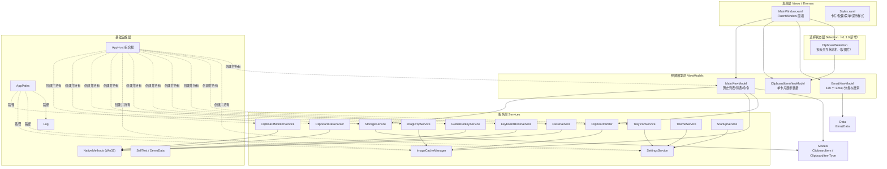
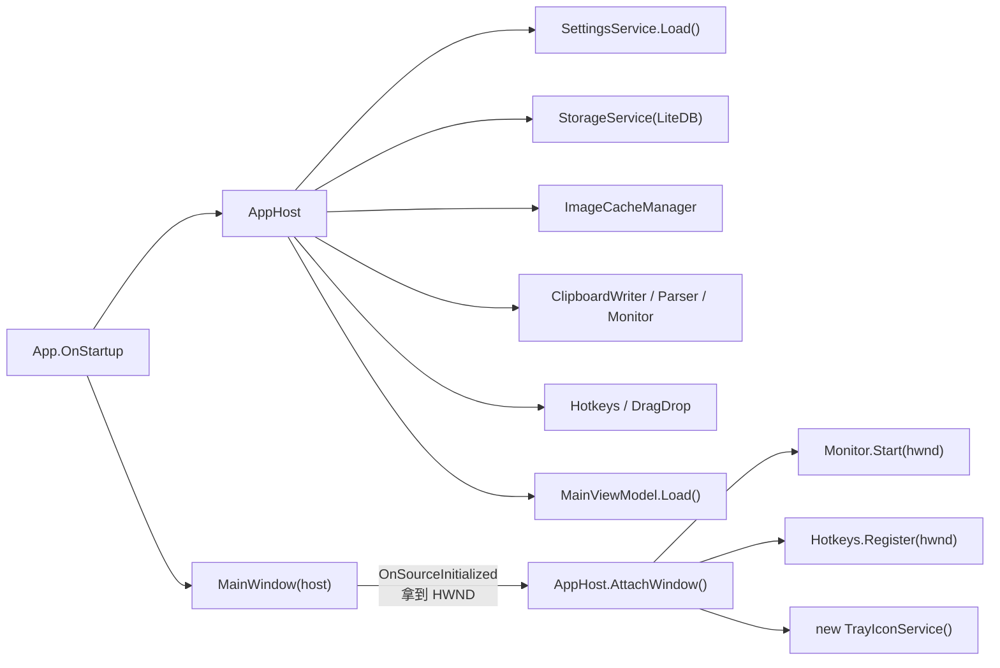
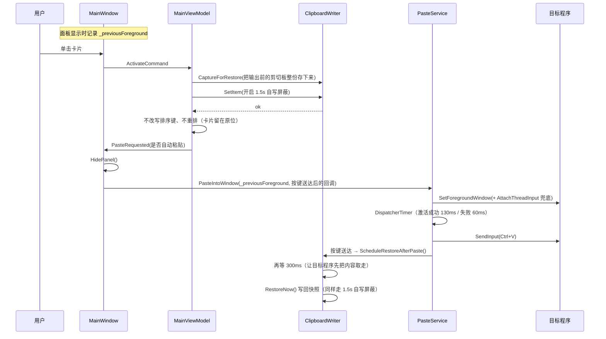

# 01 · 架构设计

## 1. 项目定位

一个 Windows 剪切板增强工具：常驻托盘、按需弹出面板，自动收录**文本 / Emoji / 图片（含 Win+Shift+S 截图）/ 文件**，
支持把历史内容（尤其图片）**拖拽**到外部程序，也支持把外部文件拖进面板归档。

原始需求见 [00-原始设计文档.txt](00-原始设计文档.txt)（剪切板主体功能）与
[09-Win+V拦截需求与方案.txt](09-Win+V拦截需求与方案.txt)（v1.1.0 的 Win+V 接管），本文档描述**实际落地后的架构**。
当前版本 **v1.3.1**（v1.2.1 收藏项独立分区、v1.2.2 呼出焦点策略、v1.2.3 拖出收尾与「始终置顶」+
面板输出不再改变历史排序位置、v1.2.4 输出只借一次剪切板：粘贴送达后把剪切板还原成输出前的内容、
v1.3.0 多选图片拖出：Ctrl/Shift 选中多张图片后拖动其中任意一张即整批拖出、
v1.3.1 多选拖出的顺序改为"Ctrl 点击序 / Shift 区间仍按列表序"，
见 [CHANGELOG.md](CHANGELOG.md)）。

## 2. 技术栈

| 维度 | 选型 | 版本 | 说明 |
| --- | --- | --- | --- |
| 语言 / 运行时 | C# / .NET | 10.0（`net10.0-windows`） | 单文件自包含发布，目标机无需装运行时（发布 zip 另有"框架依赖单文件"形态，需目标机自装 .NET 10 桌面运行时，体积约 8.33 MB；两种形态见 [07 篇](07-构建发布与测试.md) 第 2 节） |
| UI 框架 | WPF | 内置 | `UseWPF=true`，PerMonitorV2 DPI |
| UI 组件库 | WPF-UI | 4.3.0 | Fluent 2 风格、Mica 背景、暗/亮主题 |
| MVVM | CommunityToolkit.Mvvm | 8.4.2 | 源生成器产出 `ObservableProperty` / `RelayCommand` |
| 存储 | LiteDB | 5.0.21 | 单文件 NoSQL，存文本与元数据 |
| 托盘 | H.NotifyIcon.Wpf | 2.4.1 | 托盘图标 + 右键菜单 |
| 图片 | WPF 自带 `System.Windows.Media.Imaging` | — | PNG 编解码，无额外图像库 |
| 系统集成 | 原生 Win32 P/Invoke | — | 剪切板监听、全局热键、模拟按键、窗口定位 |

> 详细依赖（含传递依赖、许可证）见 [03-依赖与技术栈.md](03-依赖与技术栈.md)。

## 3. 分层架构



**依赖方向**：Views → ViewModels → Services → 基础设施。服务之间只有少数几处必要依赖
（`ClipboardWriter`→`ImageCacheManager`、`DragDropService`→`ImageCacheManager`、各服务→`SettingsService`），
没有反向依赖，服务层不引用任何 View。

`Selection`（v1.3.0 新增）是一条**旁挂的交互状态链**：由表现层创建并持有（`MainWindow._selection`），
只读 `MainViewModel.Items` 这个 `ObservableCollection`、只写 `ClipboardItemViewModel.IsMultiSelected`，
既不落盘也不参与排序 —— 所以它**既不是服务层、也不是视图模型层**，而是"面板内一次交互的状态"。

**Win+V 相关的两条额外连线**（图中省略以免交叉）：`AppHost` 订阅 `SettingsService.Changed`
来启停 `KeyboardHookService`（`ApplyWinVHook`）；`KeyboardHookService.WinVPressed` 与
`GlobalHotkeyService.Pressed` 一样，最终调用 `MainWindow.TogglePanel()`。

## 4. 模块职责

### 4.1 服务层

| 服务 | 职责 | 关键成员 | 依赖 |
| --- | --- | --- | --- |
| `ClipboardMonitorService` | 用 `AddClipboardFormatListener` 把剪切板变化转成 `WM_CLIPBOARDUPDATE`，80ms 去抖后派发事件 | `Start/Stop`、`ClipboardUpdated`、`IsPaused` | NativeMethods |
| `ClipboardDataParser` | 读取剪切板并按 `FileDrop → PNG → DIB/Bitmap → UnicodeText` 优先级解析；对 `CLIPBRD_E_CANT_OPEN` 做 3 次退避重试 | `TryRead`、`MakeOpaque`、`IsImageFile` | 剪切板、设置 |
| `ClipboardWriter` | 把历史条目写回剪切板；写入前后用 1.5s 屏蔽窗口防止自触发；另负责**输出前的剪切板快照与粘贴送达后的还原**（"借一次就还"） | `SetText/SetImage/SetFiles/SetItem`、`IsSuppressed`、`CaptureForRestore`、`ScheduleRestoreAfterPaste`、`RestoreNow` | ImageCacheManager、NativeMethods |
| `StorageService` | LiteDB 持久化：去重、收藏、按 **`LastUsedAt`**（收录时间；收藏 / 取消收藏也会刷新它）排序、超限裁剪、`Shrink()`（压缩数据库文件）；**面板输出不改写它** | `AddOrTouch`、`GetAll`、`Prune`、`Clear`、`Shrink` | Models |
| `ImageCacheManager` | 位图 → PNG 落盘（内容哈希命名）、缩略图解码 + LRU 缓存、拖拽导出文件、孤儿清理 | `SavePng`、`Normalize`、`GetThumbnail`、`EnsureExportFile`、`CollectGarbage` | AppPaths |
| `DragDropService` | 构造 OLE `DataObject`（FileDrop + Bitmap + PNG）并启动 `DoDragDrop`；也负责解析外部拖入的数据。v1.3.0 增集合版：多张图片**只用 FileDrop**（`BuildDataObjectForImages`），单张仍走原路径 | `BuildDataObject`、`DoDragDrop`、`BuildDataObjectForImages`、`ParseDroppedData` | ImageCacheManager |
| `GlobalHotkeyService` | `RegisterHotKey` 注册全局热键，失败自动降级 | `Register`、`ActiveHotkey` | NativeMethods |
| `KeyboardHookService` | `WH_KEYBOARD_LL` 拦截 Win+V：注入哑键抑制开始菜单、异步派发唤起、截断 V 键 | `Start/Stop`、`WinVPressed`、`IsRunning` | NativeMethods、WPF Dispatcher |
| `PasteService` | 激活目标窗口 + `SendInput` 模拟 Ctrl+V；绕过前台锁定；抢回自身面板焦点；按键**成功发出**后回调一次（供剪切板还原） | `PasteIntoWindow`、`ActivateWindow`、`ForceForeground`、`SendPasteKeystroke` | NativeMethods |
| `TrayIconService` | 托盘图标、右键菜单、气泡，菜单勾选状态同步 | `SyncState`、多个事件 | H.NotifyIcon、设置 |
| `SettingsService` | `settings.json` 读写（原子写：临时文件 + Move 覆盖） | `Load/Save/Update` | AppPaths |
| `ThemeService` | 应用 WPF-UI 主题（跟随系统/浅色/深色） | `Apply`、`WatchSystemTheme` | WPF-UI |
| `StartupService` | 开机自启（HKCU Run 键，带 `--startup` 参数） | `IsEnabled/SetEnabled` | 注册表 |
| `Log` | 线程安全文件日志，自动清理 14 天前日志 | `Info/Warn/Error` | AppPaths |
| `SelfTest` | 110 项无界面自检（`--selftest`） | `Run` | 全部核心服务 |
| `DemoData` | 演示数据，用于界面核对与截图回归 | `SeedAsync` | 主 ViewModel |

### 4.2 视图模型层

| 类型 | 职责 |
| --- | --- |
| `MainViewModel` | 历史列表装载/筛选/搜索、入库编排（`IngestAsync`）、复制粘贴/删除/收藏/另存为等命令、Toast 提示、设置项双向绑定、页面切换 |
| `ClipboardItemViewModel` | 单张卡片的展示数据：文本预览（按**文本元素**截断，不会切断 Emoji 代理对）、缩略图路径、相对时间、体量、类型图标 |
| `EmojiViewModel` | 8 个分类 + 439 个 Emoji，中英文关键词搜索（上限 300 条结果） |

### 4.3 选择状态层（v1.3.0 新增）

| 类型 | 职责 |
| --- | --- |
| `ClipboardSelection` | 面板内的**多选交互状态机**（本期仅图片参与）：维护已选集合与 Shift 锚点，把结果交给页脚提示与拖拽导出；订阅 `Items.CollectionChanged`，只在 `Reset`（整体重建）时清空 |

**为什么独立成一个文件**（而不是并进 `MainViewModel`）：

1. `MainViewModel` 已 **1097 行**（列表 / 命令 / 设置 / Toast 已占满），再塞一份"选择 + 锚点 + 区间计算"只会更难维护；
2. 选择是**交互状态**：不持久化、不参与排序与筛选，与 VM 的"数据 + 命令"不同层（参见 §8 决策表）；
3. 独立类型可以在 `--selftest` 里**无界面直接构造断言**（`new ClipboardSelection(items)` 就行），
   而 `MainViewModel` 需要 storage / images / writer / settings / hook 五个依赖才能构造。

三条对外约定：**唯一写入方**（只有它能改 `ClipboardItemViewModel.IsMultiSelected`）、
**输出顺序 = 选择队列顺序**（v1.3.1 改口径：**有 Ctrl 参与 ⇒ 点击顺序** —— Ctrl 新增追加到队列末尾、
取消后重新点选也排到末尾，其后按 Shift 只把区间里**尚未进队列**的图片按列表升序**补到末尾**、
绝不重排也不取消已选项；**纯 Shift**（全程无 Ctrl）⇒ 区间整体换入、按**列表顺序**，
即 v1.3.0 的旧行为一字未改）、**只在 `Reset` 时清空**
（新内容入库的 `Insert` / `Move` 不打断已选集合）。`ToggleImage()` 对非图片返回 `false`，
表示"这次点击被拒绝"——调用方据此给一条 Toast，且**不改动**已有选择。

### 4.4 表现层

`MainWindow` 是唯一的窗口，承载三个页面（历史 / Emoji / 设置，用 Visibility 切换而非多窗口）。
它同时是**视图层职责的集中点**：窗口定位、焦点与隐藏策略、拖拽交互、键盘快捷键、顶部导航的落地。

这些是纯 UI 行为，因此刻意留在 code-behind 而不是 ViewModel。其中顶部导航（v1.2.0）值得单独说明：

```
用户点击某个胶囊
   ↓ WPF 同组互斥：被点者 IsChecked=true（其它胶囊自动取消）
   ↓ IsChecked 双向绑定回写 Filter / Page（只负责"选中态"的展示与状态）
   ↓ Checked 事件 → MainWindow.OnMainChipChecked（Tag 标明目标）
        ├─ Tag = "history-*" → 先 SetPageCommand("history")，再 SetFilterCommand(后缀)
        └─ Tag = "emoji"/"settings" → SetPageCommand(...)
   ↓ MainViewModel.OnPageChanged / OnFilterChanged 做数据侧联动（清搜索框、重建可见列表）
```

**为什么落地放在 `Checked` 事件而不是属性 setter**：属性回调只在值**真的变化**时触发，
而"当前已经是 `All` 时再点「全部」"不产生变化 —— 页面就切不回去（v1.2.0 开发中真实踩到，
详见 [04-实现细节与坑点.md](04-实现细节与坑点.md) 坑点 9 的 ⚠️B）。
"被选中"这个动作本身总是可靠的，所以它是唯一可信的信号源。

## 5. 运行时对象图

`AppHost` 是组合根（轻量手写 DI，不引容器），按依赖顺序创建并持有全部服务：



要点：

1. **窗口句柄是所有系统集成的起点**。即使以 `--hidden` 启动也会先 `EnsureHandle()`，
   因为剪切板监听与全局热键都必须绑定到一个已存在的 HWND。
2. `AppHost.Current` 是静态入口，供 XAML 转换器（缩略图）与窗口访问。
3. `MainWindow` 关闭按钮不退出程序，而是隐藏；`ShutdownMode=OnExplicitShutdown`，只有托盘菜单「退出」才真正结束。

## 6. 核心数据流

### 6.1 剪切板 → 历史（主链路）

```mermaid
sequenceDiagram
    participant OS as Windows
    participant MON as ClipboardMonitorService
    participant HOST as AppHost
    participant PAR as ClipboardDataParser
    participant VM as MainViewModel
    participant IMG as ImageCacheManager
    participant DB as LiteDB

    OS->>MON: WM_CLIPBOARDUPDATE
    MON->>MON: 80ms 去抖
    MON->>HOST: ClipboardUpdated
    HOST->>HOST: Writer.IsSuppressed? → 是则丢弃(自身写入)
    HOST->>PAR: TryRead()
    PAR->>PAR: 3 次退避重试, 解析格式优先级
    PAR-->>HOST: ParsedClipboardContent
    HOST->>VM: IngestAsync(content)
    alt 图片
        VM->>VM: UI 线程 Normalize(冻结成纯像素位图)
        VM->>IMG: Task.Run(SavePng) 后台编码
        IMG-->>VM: path / hash / size
    end
    VM->>DB: AddOrTouch(item) 按 hash 去重
    DB-->>VM: (实体, 是否新增)
    VM->>VM: 增量插入或置顶到可见列表
    VM->>DB: Prune(MaxItems) 超限裁剪
```

### 6.2 点击卡片 → 复制 → 自动粘贴



> 「只复制不粘贴」这条路**不**走快照与还原：它的语义就是把这一条留在剪切板里等用户自己 Ctrl+V。

### 6.3 拖拽

```
拖出：卡片按下 → 记下当刻的修饰键（_gestureModifiers，整个手势都以它为准）
      → Ctrl / Shift 按住：**不启动拖拽**（这个手势是"选择"，守卫放在位移判定之前）
      → 无修饰键 + 位移超过系统阈值：
          ├─ 该卡片在已选集合里（v1.3.0）→ DragDropService.BuildDataObjectForImages(已选图片，按选择队列顺序：Ctrl 点击序 / Shift 区间列表序，v1.3.1)
          └─ 否则（含全部单张场景）      → DragDropService.BuildDataObject(item)
      → DataObject{ FileDrop(稳定路径) }，单张另附 Bitmap + PNG流 → DragDrop.DoDragDrop
      → 拖拽结束后补收尾：效果 != None 且松手点在面板外 → HideAfterDragOut() 收起面板
        （Esc 取消 / 松在空白处 → 保留；松手仍在面板内 → 保留，内部拖拽也会返回 Copy，见 04 篇坑点 6.1）
        （是否收起沿用设置项 HideOnDeactivate = 设置页「失焦即隐藏」）
拖入：外部拖到面板 → MainWindow.OnWindowDragEnter（在此取消"失焦隐藏"）→ OnWindowDragOver
      → ParseDroppedData → IngestAsync（单张图片文件会额外追加一条图片记录）
```

### 6.4 Win+V → 面板（v1.1.0 新增）

```
物理按 Win+V
   ↓ WH_KEYBOARD_LL 回调（在 UI 线程被调用，必须毫秒级返回）
判定 GetAsyncKeyState(LWIN/RWIN) 高位为 1
   ↓ SendInput 注入哑键 VK_NONAME(0xFC) 按下+抬起（重置 Shell 的 Win 键状态机）
   ↓ Dispatcher.BeginInvoke(唤起)  —— 异步，回调不等待
   ↓ return (IntPtr)1               —— V 键不再进入钩子链下游与目标窗口
UI 线程处理 BeginInvoke
   ↓ MainWindow.TogglePanel() → ShowPanel()
   ↓ MainViewModel.OnPanelShown()：清空上次留下的搜索关键词
   ↓ 显示 + 定位 → Activate()；EnsureForeground() 在前台锁定驳回时用 ForceForeground 再抢一次
   ↓ FocusPanelWithoutCaret()：键盘焦点交给**窗口本身**，不聚焦搜索框（v1.2.2）
     （抢前台期间 _showInProgress 忽略"失焦即隐藏"，由这个延时回调复位）
```

细节与坑点见 [06-Win32与系统集成.md](06-Win32与系统集成.md) §4.1 与
[04-实现细节与坑点.md](04-实现细节与坑点.md) 坑点 17。

> ⚠️ **这条链路有一个前提：前台窗口的完整性级别不高于本进程。**
> 前台窗口是提权程序（如 `run_as_admin=1` 的 Everything）时，UIPI 会**丢弃本进程的钩子回调**，
> 第一步就走不通 —— Win+V 会落到系统原生剪切板。实测证据与备选方案见
> [10-高权限窗口支持决策记录.md](10-高权限窗口支持决策记录.md)，当前决策为"暂缓、按已知边界记录"。

### 6.5 失焦隐藏与延迟缓冲（v1.2.0 可调）

```
窗口 Deactivated
   ↓ 模态框打开 / 正在拖出 / 面板正在弹出(_showInProgress) → 直接忽略
   ↓ HideOnDeactivate 关着 → 直接忽略
   ↓ 鼠标键仍按着（很可能正从别的窗口拖东西过来）→ 启动延迟计时器（默认 700ms，设置可调 50–1000ms）
        ↓ 每次 Tick 复查：鼠标键还按着 → 继续等
        ↓ 期间收到 DragEnter/DragOver → 计时器取消，面板保持可见，拖放得以完成
        ↓ 鼠标松开且窗口非激活 → HidePanel()
   ↓ 鼠标键没按 → 立即 HidePanel()
```

`Interval` 由 `MainWindow.OnSettingsChanged` 订阅 `SettingsService.Changed` 实时更新，
因此设置页拖动滑块即时生效。**调小时不会破坏拖拽**：防打断的是 `DragEnter` 取消与"按键仍按下就继续等"，
与时长无关（见 [04-实现细节与坑点.md](04-实现细节与坑点.md) 坑点 6）。

> 反向场景是**拖出**（把卡片拖到别的程序）：拖拽期间同样靠 `_isDragging` 忽略失焦，
> 但收尾必须由 `OnListPreviewMouseMove` 在 `DoDragDrop` 返回后补一次 —— 详见
> [04-实现细节与坑点.md](04-实现细节与坑点.md) 坑点 6.1。
>
> 关掉「失焦即隐藏」表示面板要常驻，此时还会遇到**层级**问题：面板虽是 `Topmost`，但被**同样置顶**的
> 窗口（全屏浏览器 / 播放器 / 其它置顶工具）激活后仍会盖住它（Windows 规则：置顶层里最后激活的在上）。
> 设置项 `KeepOnTopWhenUnfocused`（设置页「始终置顶」，默认关闭）让面板在失焦后用
> `SetWindowPos(HWND_TOPMOST, … | SWP_NOACTIVATE)` 无焦点地抬回最上层 —— 见 04 篇坑点 6.3。

## 7. 线程模型

| 线程 | 承担的工作 |
| --- | --- |
| UI 线程（STA） | 所有剪切板读写、`DoDragDrop`、窗口与焦点操作、`SendInput`、位图 `Normalize`、LiteDB 调用、列表更新；**低级键盘钩子回调也在这里执行**（钩子由 UI 线程安装，系统通过消息回调该线程） |
| 线程池 | 仅一件事：PNG 编码与落盘（`Task.Run(() => SavePng(frozen))`） |

剪切板与 OLE 拖拽强依赖 STA，因此**服务层的这些方法只能在 UI 线程调用**；
唯一的跨线程数据是已 `Freeze()` 的位图（且必须是 `Normalize` 产出的纯像素位图，原因见
[04-实现细节与坑点.md](04-实现细节与坑点.md) 第 4 条）。

> 推论：**UI 线程被长时间阻塞不仅会卡界面，还会拖慢全系统的键盘输入**（钩子回调等不到返回，
> 超过 `LowLevelHooksTimeout` 默认 300ms 钩子会被系统卸载）。所以钩子回调里只允许
> "判定 + 注入 + BeginInvoke" 三步，任何耗时逻辑都必须丢到别处。

## 8. 关键设计决策

| 决策 | 取舍理由 |
| --- | --- |
| 单窗口承载三个页面，而非多窗口 | 避免"失焦隐藏"在多个窗口间互相干扰；设置页不需要独立任务栏项 |
| 图片落盘 + 缩略图 LRU，而不是内存里存位图 | 频繁截图时内存会失控；缩略图按需解码，卡片被虚拟化回收后位图可被 GC |
| 内容哈希命名图片文件 | 天然去重，同一张图重复复制不会产生多份文件 |
| 历史去重后"置顶"而非新增一条 | 列表更干净；"同一份内容再次进入剪切板"等价于"最近收录"，置顶符合剪切板工具直觉。**但"输出"不触发置顶**：排序键 `LastUsedAt` 只由入库 / 去重命中（`AddOrTouch`）与收藏 / 取消收藏（`SetPinned`）刷新，从面板**输出**（单击复制 / 粘贴、右键菜单复制、拖出）不改它，否则"用过一次"就会把老条目顶到最上面、历史顺序被打乱（v1.2.3 收窄的口径，见 [05 篇 §2.2](05-数据模型与存储.md)） |
| 手动组合根（`AppHost`）而非 DI 容器 | 服务数量固定、生命周期与进程一致，容器带来的抽象收益不足 |
| 拖拽数据同时给 FileDrop + Bitmap + PNG | 不同外部程序各取所需，见第 06 篇的格式矩阵 |
| 面板用物理像素定位（Win32 `SetWindowPos`） | 规避 DIP/DPI 换算误差，多显示器 + 高 DPI 下依然贴右下角 |
| 自检覆盖核心链路 | GUI 工具难以做单元测试，用一个 `--selftest` 入口覆盖存储/图片/剪切板/拖拽/监听/热键 |
| 用低级键盘钩子接管 Win+V，而不是改注册表 / 重启 explorer | 零注册表入侵、立即生效、可随时开关；代价是要守住钩子回调的时限与生命周期（坑点 17） |
| Win+V 与 Ctrl+Shift+V 两条唤起路径并存 | 接管被关闭或钩子安装失败时仍有可用入口；实现上两者共用 `TogglePanel()` |
| 顶部导航合并为**一条**胶囊主链（含「全部」），而不是"分页 + 筛选"两组 | 两组胶囊语义重叠（"历史"与"全部"几乎等价）且窄窗口会互相挤占；合并后只有一个 `GroupName`，任何时候只有一个选中态，视觉逻辑唯一（[CHANGELOG v1.2.0](CHANGELOG.md)） |
| 顶部导航的落地放在 `Checked` 事件，而不是属性 setter | "值没变"时 setter 不触发，会导致跨页点"当前已选中"的筛选没反应（坑点 9 ⚠️B）；"被选中"事件始终可靠 |
| 隐藏延迟做成可配置项（而非写死 700ms） | 700ms 是"防拖拽被打断"与"失焦收起要跟手"之间的折中，不同用户偏好差异大；做成设置项后不用替所有人做选择。防打断机制本身与时长无关，所以调小是安全的 |
| 不接受"为接管提权窗口而整体提权"或"关掉原生剪切板历史" | 前者会让本程序无法与普通程序交互剪切板（坑点 12），后者让用户永久失去系统功能；两者都是按下葫芦浮起瓢。详见 [10-高权限窗口支持决策记录.md](10-高权限窗口支持决策记录.md) |
| 收藏项做成**独立分区**（只在 ⭐ 显示），而不是像系统剪切板那样置顶混排 | 收藏是"长期留存的少数条目"，混排时一多就会把新剪切的内容挤出首屏；分区后「全部」= 干净的时间流，收藏靠 ⭐ 一个入口进。代价是"收藏时卡片会从当前视图消失"，用一条 Toast 交代去向即可（[CHANGELOG v1.2.1](CHANGELOG.md)） |
| 搜索也严格排除收藏项，不做"搜索时放行"的例外 | 只在搜索时放行会让"同一个列表里有没有收藏项"出现两套规则，用户难以预测；宁可规则单一，收藏内容统一去 ⭐ 里搜 |
| 呼出面板时不聚焦搜索框、也不再"打字即搜索"（v1.2.2） | 原来的"呼出即可打字搜索"等于把面板一弹出就置入输入模式：光标在搜索框里闪，误触的按键还会悄悄变成过滤条件把列表筛空。现在焦点交给窗口本身（Esc / Enter / ↑↓ / Ctrl+F 全在窗口级 `PreviewKeyDown` 处理，不依赖子控件焦点），搜索改用 Ctrl+F 或点击明确进入；每次呼出顺带清空上次关键词，避免残留过滤条件看起来像"记录丢了" |
| 多选状态放在**独立类型** `ClipboardSelection`，既不放 `MainViewModel` 也不放 `ListBox.SelectionMode` | ① 状态机要能被 `--selftest` 无界面构造断言，塞进 1097 行的 `MainViewModel` 就只能靠界面测；② 实施方案 §3.7 原本要求给 `HistoryList` 加 `SelectionMode="Extended"`，**本期没有加**（保持 WPF 默认的 `Single`），理由是 ListBox 的选中发生在 `MouseLeftButtonDown`（冒泡阶段），**早于**我们处理 `PreviewMouseLeftButtonUp` 的时刻，所以"预览事件已 `e.Handled` 所以不打架"这个理由不成立；而且加了 `Extended` 之后 Shift 点击会把区间里的**文本 / 文件**卡片也画上 1px 强调色"当前项"边框，看起来像被选中，与"多选仅对图片生效"冲突。多选状态完全由 `ClipboardSelection` 表达，功能验收标准不受影响 |
| 多选**只对图片**生效；批量删除 / 批量收藏 / 批量粘贴到原窗口 / 批量复制到剪切板 / 键盘多选本期都不做 | 图片才是"拖出去"的真实需求（截图批量拖进聊天窗 / 文件夹）。未做项里**批量粘贴风险最高**：要动 `PasteService` 的单槽位目标窗口与 `ClipboardWriter` 单份快照的"借一次就还"契约（v1.2.4），其余为控制回归面。未做清单与原因见 [08 篇 §2.2](08-后续开发路线.md)；`ClipboardWriter` / `PasteService` / `StorageService` 本次一行未改，系统剪切板契约不变 |

## 9. 目录结构

```
LightClipboard/
├─ README.md                       项目说明（面向使用者）
├─ resources/                      本资料库
├─ tools/                          开发期脚本（不参与程序运行）
└─ src/LightClipboard/
   ├─ LightClipboard.csproj        目标框架、依赖、发布配置
   ├─ app.manifest                 asInvoker + PerMonitorV2 DPI + longPathAware
   ├─ App.xaml(.cs)                单实例、命令行、生命周期
   ├─ AppHost.cs                   组合根
   ├─ Assets/app.ico               多尺寸图标（由 tools/make-icon.ps1 生成）
   ├─ Converters/                  XAML 值转换器
   ├─ Data/EmojiData.cs            439 个 Emoji 数据
   ├─ Interop/NativeMethods.cs     全部 Win32 声明
   ├─ Models/                      LiteDB 文档模型
   ├─ Services/                    16 个服务/工具类（清单见 §4.1）+ AppPaths + AppSettings
   ├─ Selection/ClipboardSelection.cs  多选交互状态机（仅图片，v1.3.0 新增，见 §4.3）
   ├─ ViewModels/                  3 个视图模型
   └─ Views/MainWindow.xaml(.cs)   面板
```

逐文件说明见 [02-源码导读.md](02-源码导读.md)。
